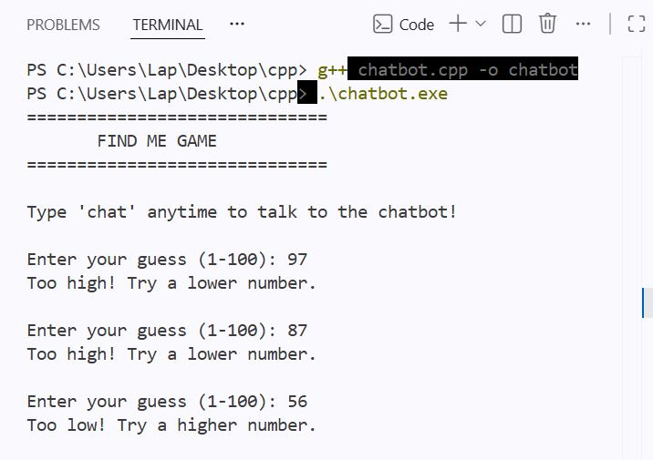
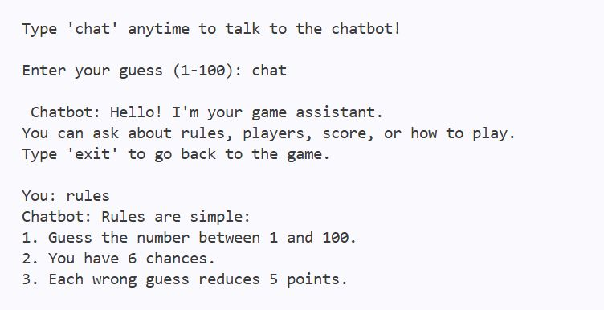
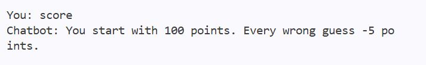
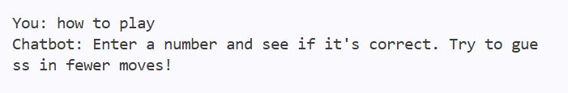
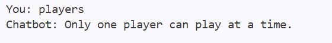
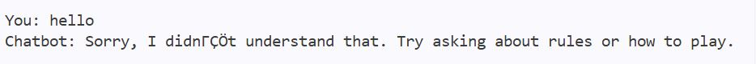
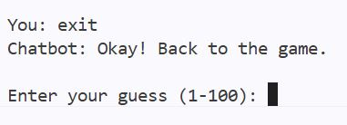
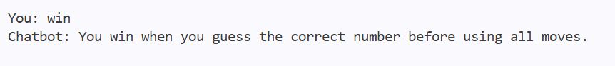

# 🤖 C++ Chatbot Number Guessing Game

A simple C++ console application that combines a Number Guessing Game with a Rule-Based Chatbot.

## Features

* Number Guessing Game
* Rule-Based Chatbot
* Case-Insensitive Input
* Score Tracking
* Input Validation
* Random Number Generation
* Keyword-Based Responses
* Interactive Chat Support

## How to Run

### Compile

```bash
g++ chatbot.cpp -o chatbot
```

### Run

```bash
./chatbot
```

## Technologies Used

* C++
* STL (String, Algorithm)
* Random Number Generation
* Git
* GitHub

## Screenshots

### Game Start



### Rules Response



### Score Response



### How To Play



### Player Query



### Unknown Input Handling



### Exit Chatbot



### Winning Screen



## Project Highlights

* Developed a console-based Number Guessing Game in C++.
* Integrated a rule-based chatbot using keyword matching.
* Implemented case-insensitive user input handling.
* Added score tracking and move limitation.
* Used random number generation for dynamic gameplay.
* Applied input validation and exception handling.

## Author

**Asha Kamal**
